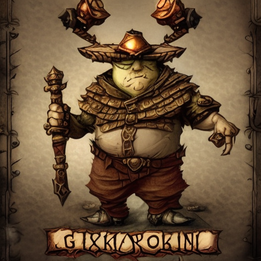
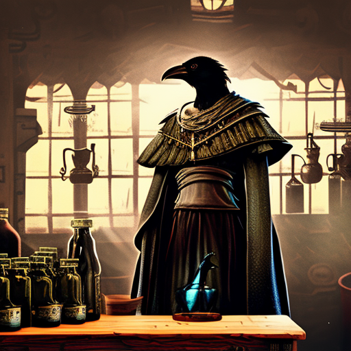

# Worldweaver

**Worldweaver is a work in progress and at the very early PoC-building stage. This document describes our vision for what it will become.**

Worldweaver is an application that synthesises immersive art and music to enrich tabletop roleplaying game experiences for the players.

It leverages generative AI along with speech-to-text models to listen to your mic and transcribe in-game dialogue and actions, all to provide an immersive and dynamic gaming environment. 

The dungeon master specifies the core setting  of the world and tone of the plot. The players provide character descriptions (and potentially illustrations or photographs of their likeness) which are used as inputs to generate compelling, contextually relevant art and music to accompany the game.

Worldweaver is aimed at tabletop RPG enthusiasts, game masters, and players looking to enhance their gaming experiences with immersive visuals and sounds.

  

*"A short,fat, wrinkled goblin character. Scowling. Standing over a pile of gizmos.Steampunk aesthetic. Day. RPG class card portrait. Engineer"*

  

*"Robed human-sized crow with arms. Feathered. Female.Maniacal. Standing over a wooden table filled with potions.Clutching coloured vials to its chest Beside a Cauldron. Steampunk aesthetic. Outside. Town in background. Day. RPG class card portrait. Alchemist."*

## Key Features

### AI-Generated Art

Worldweaver dynamically creates visual content based on the game narrative, characters, and setting. Users customize art styles and themes by providing natural language prompts.

### AI-Generated Music

Synthesize adaptive background music and sound effects based on the game's mood, events, and actions, all transcribed from the players' conversation. Enable users to select preferred musical genres and styles for a personalized gaming atmosphere.

### Recording

Record and store game sessions (including transcripts and character art) for later review, sharing, or analysis. Include editing tools to create highlights or compile memorable moments. Relive the events of the game later with entirely AI-generated art and music.

Provide a searchable text archive of previous game sessions for easy reference and to seed new spin-off games.

## Design goals

### Intuitive Interface

Worldweaver aims for a user-friendly interface that allows easy navigation and customization,
providing onboarding tutorials and tooltips for first-time users for a low barrier-of-entry. 

### Cross-Platform Compatibility

We aim to eventually develop the application for web, mobile, and desktop platforms to ensure accessibility for all users. Sync user data and preferences across devices for a seamless experience, and allow every player to interact with the worldweaver interface.

### Community Features

We aim to implement social sharing features and a community hub for users to share their creations, collaborate, and discuss gaming experiences.

We want to support user-generated content, and allow users to share custom art, music, and game scenarios.

### Accessibility

Incorporate accessibility features such as adjustable text sizes, alternative input methods, closed captioning for in-game audio, and colour accessibility.

## PoC components

We aim to first build a minimal proof of concept to demonstrate the core functionality we want to achieve.

We want to generate art in the form of a static image from a written blurb about each character.

We want to be able to generate appropriate music from the description of a general scene, for example entering a dungeon, walking through a forest, or entering an inn.

### Example inputs (PoC)

DM:

This is a cyberpunk world ruled over by pig men who were formally a slum class who have risen up and subjugated the formerly ruling class who were waifey elf-like figures.

Player 1:

A Goblin engineer who has learned to craft mechanisms from the salvaged wreckage that litters the land.

Player 2:

A Bird-person alchemist who crafts potions and sells them to any who have enough coin. The effects can be toxic, or rather potent, depending on the customer.

## Licensing

All written content, images, audio, videos and other media in this repository are licensed under a Creative Commons CC BY-SA 3.0 license. This means you are free to use, share, and adapt this work for any purpose, as long as you give appropriate credit and indicate any changes made. This also means that anyone who uses this work must also license their work under CC BY-SA, and they must give credit for the original creation. Please refer to the [LICENSE](./LICENSE.md) file for more information about the specific terms of this license.

All code in this repository is licensed under the [GNU Public License version 3](./LICENSE_CODE.md).

[Everything in the universe is in the public domain. May the last intellectual property lawyer be hung with the guts of the last judge.](http://humaniterations.net/about.html)
